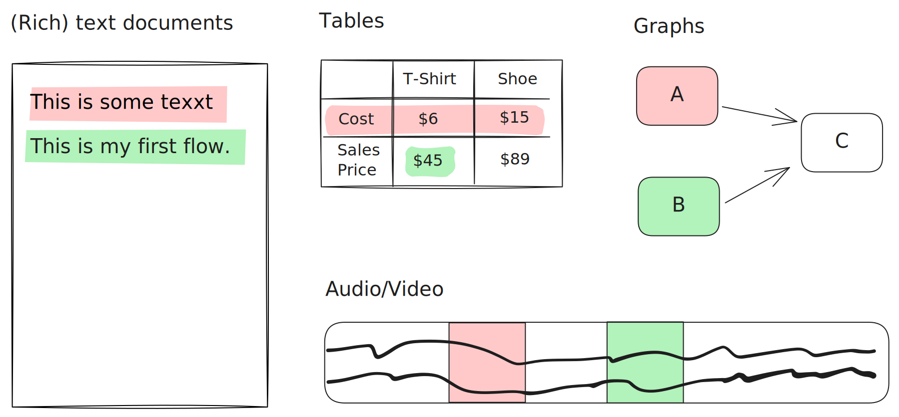

# Diffs

Lix provides APIs to query any two states of your data—the "before" and "after"—which is the foundation for showing users what has changed. These states can be from different points in [history](./history.md) or different [versions](./versions.md).


## Rendering Diffs

Lix's responsibility is to provide the before and after states and/or changes between states. Lix relies on plugins to provide the UI for rendering diffs, or developers to implement their own rendering logic.

### Plugin Provided Diffs

Lix plugins can provide ready-to-use diff components. These components can be rendered directly in your application, offering a quick way to display changes.

However, this convenience comes with a trade-off: you are limited to the UI and rendering logic provided by the plugin. If you need more control over the appearance or behavior of the diffs, you may want to consider other options.

```tsx
const lix = await openLix({});

const plugin = (await lix.plugin.getAll()).find((p) => p.key === "csv_plugin");

if (plugin?.diffComponent) {
  customElements.define("csv-diff-component", plugin.diffComponent);
  // Render the diff component in your application
  // This will depend on your framework (React, Vue, etc.)
  <csv-diff-component diffs={changes} />;
}
```

### Diff Libraries

For custom data formats, you can use a dedicated library. The experimental [universal diff package](https://github.com/opral/monorepo/tree/main/packages/lix/universal-diff) is one such option.

### Build Your Own

You always have the flexibility to implement your own diff rendering logic for complete control over how changes are detected and displayed. 

Lix is unopinionated about how you visualize changes. Because Lix provides "before" and "after" states (or changes in between states), you can build any kind of diff UI you can imagine—from text-based diffs to visual comparisons of images, designs, or even 3D models, as illustrated below.



## Code Examples

### Diffing a JSON file

The following example shows how to query two versions of a JSON file and then generate a simple textual diff.

```ts
import { openLix, entityIs } from "@lix-js/sdk";

const lix = await openLix({});

// 1. Get the last two versions of a JSON file from history
const fileHistory = await lix.db
  .selectFrom("file_history")
  .where("id", "=", "json-file-id")
  .orderBy("lixcol_created_at", "desc")
  .limit(2)
  .execute();

const afterState = JSON.parse(fileHistory[0].data);
const beforeState = JSON.parse(fileHistory[1].data);

// 2. Compare the two states to generate a diff.
//
// This is a simplified example. In a real app,
// you would likely use a diffing library.
const diffOutput = [];
if (beforeState.name !== afterState.name) {
  diffOutput.push(`- name: ${beforeState.name}`);
  diffOutput.push(`+ name: ${afterState.name}`);
}
if (beforeState.version !== afterState.version) {
  diffOutput.push(`- version: ${beforeState.version}`);
  diffOutput.push(`+ version: ${afterState.version}`);
}

// 3. The diff can then be displayed in your application.
console.log(diffOutput.join("\n"));
```

Assuming the `name` and `version` properties changed, the output would look like this:

```diff
- name: My Project
+ name: My Awesome Project
- version: 1.0.0
+ version: 1.1.0

```

### Diffing a single entity

This example shows how to diff a single entity. While the example uses a JSON property, the same principle applies to any entity defined by a Lix plugin, such as a paragraph in a Markdown document or a cell in a CSV file. Diffing at the entity level is more efficient than diffing an entire file when you only care about a specific part of the data.

```ts
// This example assumes `beforeChangeSetId` and `afterChangeSetId` are known.

const jsonProperty = {
  entity_id: "name", // ID for the 'name' property
  schema_key: "json_property", // provided by the plugin
  file_id: "json-file-id", // ID of the JSON file
};

// 1. Get the before and after state of a specific JSON property entity
const entityBefore = await lix.db
  .selectFrom("state_history")
  .where("lixcol_change_set_id", "=", beforeChangeSetId)
  .where(entityIs(jsonProperty))
  .selectAll()
  .executeTakeFirst();

const entityAfter = await lix.db
  .selectFrom("state_history")
  .where("lixcol_change_set_id", "=", afterChangeSetId)
  .where(entityIs(jsonProperty))
  .selectAll()
  .executeTakeFirst();

// 2. The returned states can be used to show the change.
if (entityBefore && entityAfter) {
  console.log(
    `The "name" property changed from "${entityBefore.snapshot_content}" to "${entityAfter.snapshot_content}"`
  );
}
```

This would output a string like:

```
The "name" property changed from "My Project" to "My Awesome Project"
```
